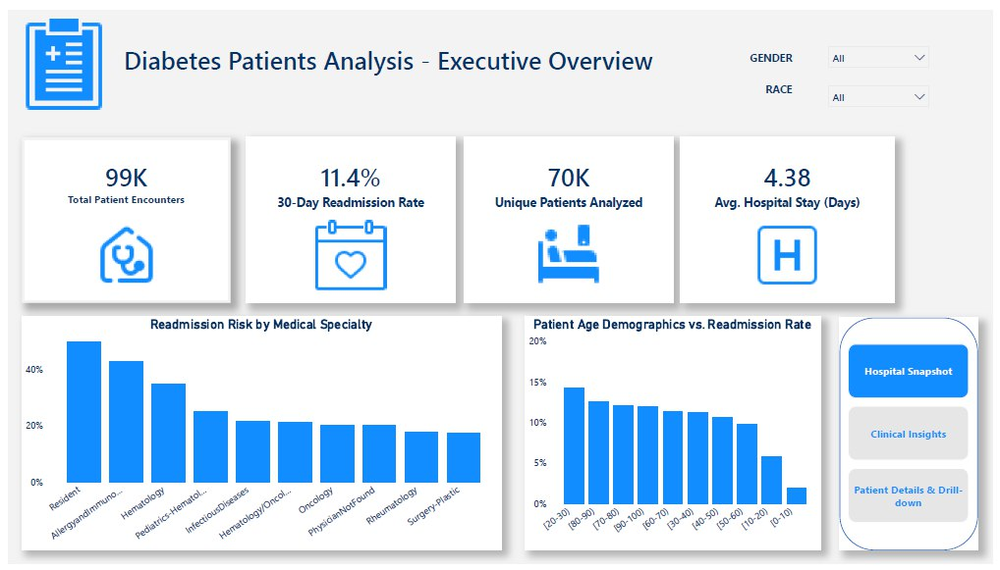
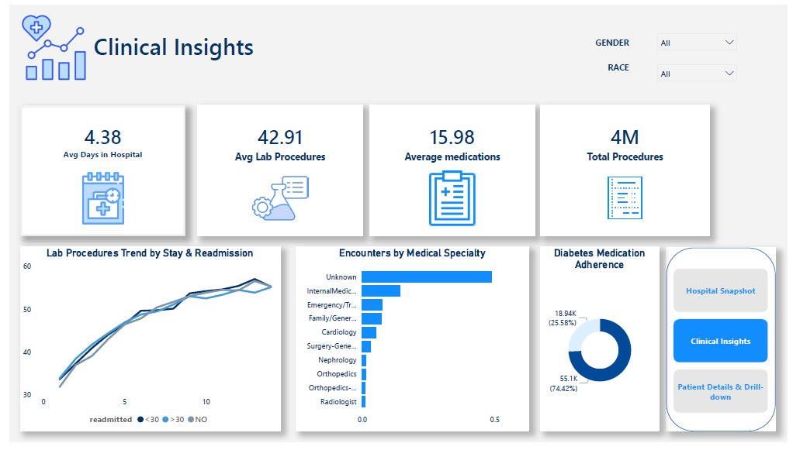
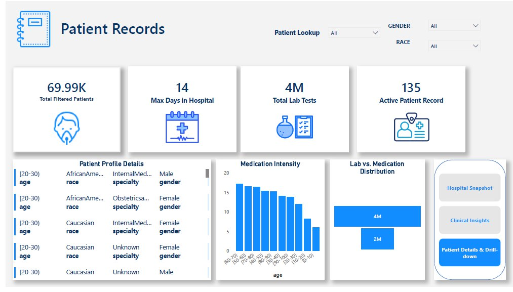

# Diabetes Patients Analysis Dashboard 🏥📊

## 📌 Project Overview
An interactive Power BI healthcare analytics dashboard designed to analyze hospital secondary-care data for patients with diabetes.
The project focuses on understanding patient demographics, clinical activity, hospital utilization, and readmission patterns, helping healthcare providers and hospital management explore where higher readmission rates occur and which patient or clinical factors may require further investigation.

Rather than simply reporting hospital KPIs, the dashboard connects multiple dimensions of patient data to answer questions such as:
* Which patient groups have higher readmission rates?
* How does readmission vary across medical specialties?
* Is there a noticeable pattern between length of stay and readmission?
* How does clinical activity differ across patients?
* How can individual patient records be explored efficiently?

---

## 📊 Executive Overview
The first dashboard page provides a high-level view of hospital performance through:
* Total Encounters
* Unique Patient Count
* Readmission Rate
* Readmission patterns across Medical Specialties
* Demographic analysis by Age and Race
* Comparison of demographic groups against readmission rates

This view allows hospital stakeholders to quickly identify areas that may require deeper analysis.

---

## 🔎 Clinical Insights
The clinical analysis focuses on patient activity and hospital utilization.

### Clinical Activity
Analysis of:
* Average Laboratory Procedures
* Medication Usage
* Clinical Activity Volume

This helps provide context around the level of clinical intervention associated with different patient groups.

### Length of Stay & Readmission
The dashboard explores the relationship between:
**Days in Hospital → Clinical Activity → Readmission**

The objective is not to assume causation, but to identify patterns and segments that deserve further investigation.

### Medical Specialty Analysis
Patients are segmented by medical specialty to identify differences in:
* Patient volume
* Clinical activity
* Readmission patterns

This can help management identify specialties that may benefit from additional operational or clinical review.

---

## 👤 Patient-Level Analysis
The Patient Records page provides an interactive drill-down experience.

Users can search for a specific patient using their **Patient ID** and dynamically view:
* Age & Gender
* Medical Specialty
* Laboratory Procedures
* Medication Information
* Hospitalization Details
* Clinical Activity Volume

This transforms the dashboard from a high-level reporting tool into an exploration and patient-record analysis interface.

---

## 💡 Business & Healthcare Insights
The dashboard is designed to move from **"What is happening?"** to **"Where should we investigate further?"**

* Differences in readmission rates across specialties or demographic groups can help stakeholders identify areas for deeper investigation.
* Analyzing length of stay and clinical activity alongside readmission provides additional context when evaluating hospital utilization.
* Supports a data-driven approach to identifying patterns, prioritizing investigations, and improving healthcare operations.

> **Important:** The analysis is descriptive and exploratory. Observed patterns should not be interpreted as medical diagnoses or causal relationships without further clinical investigation.

---

## 🛠️ Technical Implementation

### Data Modeling
* Established relationships between multiple healthcare datasets.
* Designed the data model to support cross-filtering between patient, clinical, demographic, and hospital activity data.
* Structured the model for efficient Power BI reporting.

### DAX
Created custom DAX measures for:
* Readmission Rate
* Average Clinical Procedures
* Average Medication Usage
* Patient and Encounter KPIs
* Dynamic Titles
* Context-aware calculations

### Data Visualization
Implemented a variety of Power BI visualizations, including:
* KPI Cards & Multi-row Cards
* Conditional Formatting
* Gauge Charts & Funnel Charts
* Interactive Tables
* Demographic Visualizations

### Interactive UI/UX
Built an interactive navigation experience using:
* Custom Navigation Buttons
* Slicers & Drill-down functionality
* Patient Search & Dynamic filtering
* **Smart Narratives:** Integrated Power BI Smart Narratives to provide automated summaries and additional context for dashboard users.

---

## 🗂️ Dashboard Structure
1. **Executive Overview:** Hospital-level KPIs, demographics, specialties, and readmission analysis.
2. **Clinical Insights:** Clinical activity, medication usage, laboratory procedures, length of stay, and readmission patterns.
3. **Patient Records:** Patient-level search and detailed clinical profile analysis.

---

## 🎯 Project Objectives
* Transform complex healthcare data into an intuitive analytical interface.
* Identify patterns in hospital readmission.
* Analyze patient demographics and clinical activity.
* Provide both executive-level and patient-level views.
* Demonstrate how Power BI can support healthcare analytics and operational decision-making.

---

## 🔧 Tools & Technologies
`Power BI` | `DAX` | `Data Modeling` | `Data Visualization` | `Power BI Smart Narratives` | `UI/UX`

---

## 🚀 Key Takeaway
This project demonstrates how healthcare data can be transformed from raw patient records into an interactive analytical solution that connects:

**Patient Demographics → Clinical Activity → Hospital Utilization → Readmission Patterns**

The ultimate goal is not simply to display healthcare data, but to make it easier for stakeholders to identify patterns, ask better questions, and make more informed decisions.
